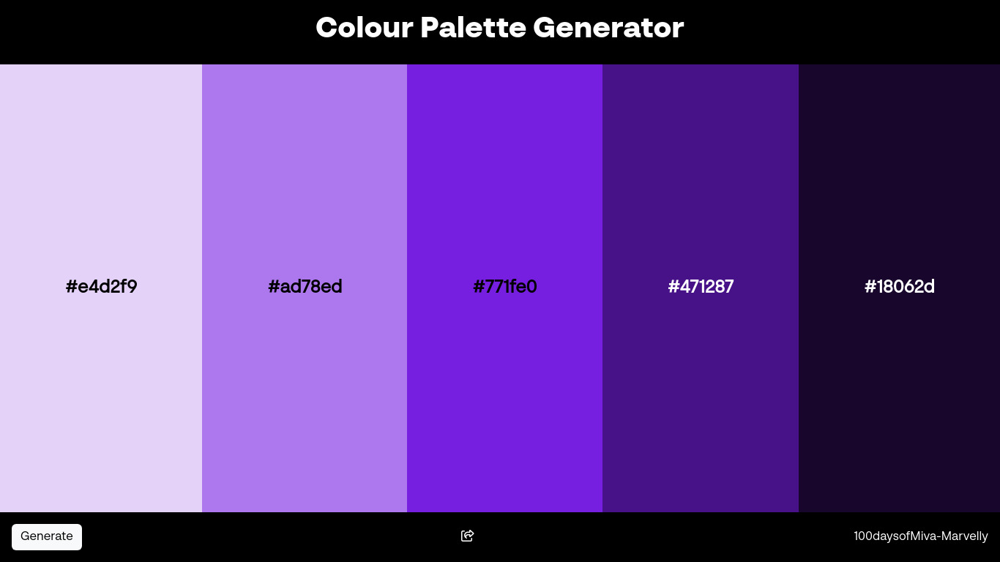

# 🎨 Color Palette Generator

This is a **Color Palette Generator** built with **Node.js** using **Express.js** and **chroma-js**. It generates a beautiful 5-color palette every time, with varying shades of a randomly generated base color. Perfect for UI/UX designers looking for quick color inspiration! 🌈

## 🚀 Features

- Generates 5 matching colors as variants of a single base color 🎨.
- Each palette is assigned a unique ID, allowing users to retrieve it via the `/palette/:id` route.
- Built with **Express.js** for server-side logic and **chroma-js** for color manipulation.
- Simple and elegant UI for displaying the generated palette, with a refresh button to generate new palettes dynamically.

## 🛠️ Technologies Used

- **Node.js** & **Express.js**: Backend framework to handle routing.
- **Chroma.js**: For powerful color manipulation and palette generation.
- **HTML/CSS/Bootstrap**: For a clean, responsive UI.

## 🌟 Getting Started

### 1. Clone the Repository

```bash
git clone https://github.com/yourusername/color-palette-generator.git
cd color-palette-generator
```

### 2. Install Dependencies

```bash
npm install
```

### 3. Run the Application

```bash
node app.js
```

### 4. Open the Application

Visit the app in your browser at:

```
http://localhost:3000
```

You will see an interface where you can generate a new 5-color palette. Press the **Generate** button to fetch a new color palette.

### 5. Retrieve a Palette by ID

To retrieve a specific palette, go to:

```
http://localhost:3000/palette/:id
```

Replace `:id` with the ID of the palette you want to view, for example:

```
http://localhost:3000/palette/C08552-F3E9DC-5E3023-DAB49D
```

## 🔧 How it Works

1. **Generating a Palette**: Each time you click the **Generate** button, a base color is randomly generated. From this base, 5 distinct color variants (different shades) are created.
2. **Unique ID**: Each generated palette has a unique ID made from the hexadecimal values of the colors, which can be used to retrieve the palette later.
3. **Using Chroma.js**: The power of **chroma-js** ensures that the generated colors are visually appealing, offering a variety of brightness levels.

## 🐛 Issues Encountered

Building this app wasn't without its challenges! Here are some of the problems we encountered and how we solved them:

1. **Dull Color Palettes**: Initially, we were getting dull and boring colors. The issue was due to the way we were generating shades from the base color. We switched to using `hsl.l` (lightness) adjustments for better visual results.
   
2. **Color Palette Variants**: At first, we used random colors that were too different from each other. After realizing that we needed variants of the same base color for consistency, we adjusted our approach to generate color scales with different lightness levels.

3. **Invalid Palette IDs**: When trying to retrieve a palette by ID, some IDs were invalid or incorrectly formatted. We fixed this by ensuring a strict format for the IDs and adding error handling for invalid IDs.

4. **Dynamic Palette Update**: Implementing a smooth update of the UI when a new palette was generated was tricky. By using simple JavaScript and handling the loader display correctly, we ensured a seamless experience for users when generating new palettes.

## ✨ Future Improvements

- Add support for saving favorite palettes in a database.
- Enhance the UI with animations for palette generation.
- Allow users to download the color palette in various formats like JSON, CSS, or an image.

## 🖼️ Example Palette

Here’s an example of the kind of palette the app generates:

```
Base Color: #C08552
Palette: 
#F3E9DC (Light)
#5E3023 (Dark)
#DAB49D (Neutral)
```

## 📜 License

This project is licensed under the MIT License.

---

Feel free to customize it further as per your project needs! 😊